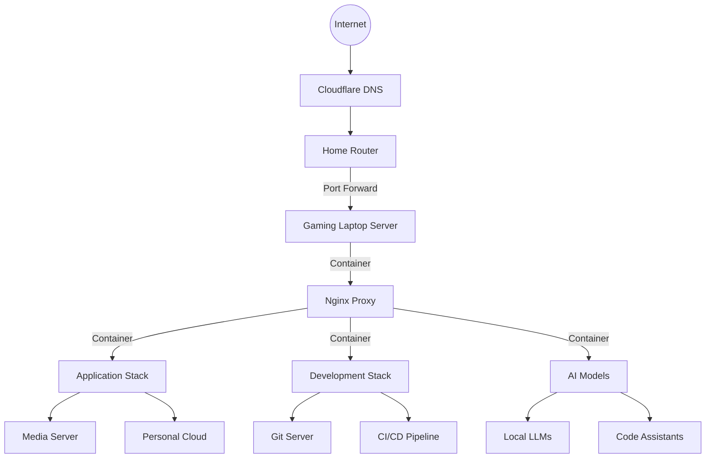
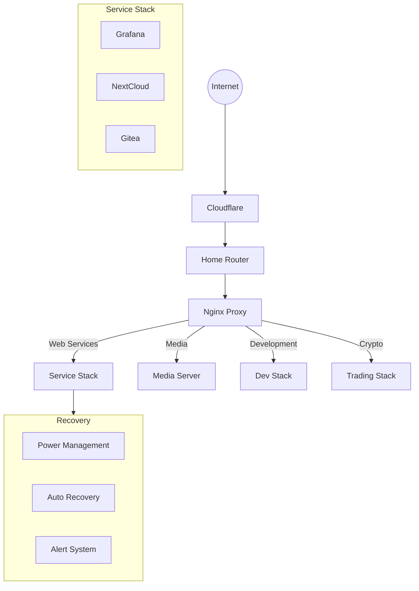

## Introduction

Moving to Chennai for an SDE role meant leaving behind my trusted **ASUS ROG laptop** - a machine that had faithfully served through countless RCB matches and intense coding sessions. With its **RTX 3060**, **16GB RAM**, and blazing-fast **1TB SSD**, it felt wrong to let it gather dust at home. One particularly frustrating evening, while battling with cloud costs for my side projects and sipping my evening filter coffee, an idea struck. Why not transform this gaming beast into a home server?

## The Birth of a Distributed System

But this wasn't going to be just another server setup. Being **600 kilometers away** from the hardware meant this would become a family project, whether they were ready for it or not. The gaming machine that once ran **PUBG** would now need to run **Docker containers**, and my casual gaming discussions with Appa would turn into talks about **system monitoring** and **power backups**.

Yes, I can finally SSH into my own server and deploy or do whatever I want.

Let's see what we're building here:



### Running a Server Remotely

Running a server remotely adds a whole new dimension to the concept of **distributed systems**. Your primary "operations team" consists of family members who think rebooting means switching the power off and on again. Every aspect of the setup needed to be foolproof, every instruction crystal clear, and every potential failure accounted for. **"Amma, laptop mela oru button irukum, please click it once?"** became our version of high-availability system management.

> **First Deployment Story**: During the initial setup weekend, I spent more time on video calls explaining what a power button looks like than actually configuring the server. Appa's suggestion to **"put a bright sticker near important buttons"** turned out to be surprisingly effective DevOps wisdom!

## The Family Support Matrix

Our version of **high availability** relies more on human reliability than system redundancy:

| Family Member | Primary Role | Backup Role | Special Skills |
|--------------|--------------|-------------|----------------|
| **Amma** | Power Management | Basic Restarts | UPS beep interpreter |
| **Appa** | Electricity Monitor | Backup Power | Power cut predictor |
| **Thangachi** | Service Monitoring | Cable Management | Grafana dashboard reader |

## Technical Foundation

### Infrastructure Evolution: From Windows to Linux

Remember trying to run multiple Docker containers on Windows? It's like trying to find parking in T Nagar during Diwali season - technically possible but way too complicated. Here's why Windows doesn't cut it:

- High resource overhead
- Random updates (worse than Chennai traffic during rains)
- WSL2 + Docker = Unnecessary complexity
- Permission systems more complex than ECR road signals

### Base Installation

First, grab Ubuntu Server (LTS version). Like choosing between idli and dosa - go with what's proven and reliable. During installation:
- Minimal installation (we're not running a gaming PC anymore)
- Enable OpenSSH server (for remote access)
- Skip optional snaps (we'll use Docker instead)

### Power Management (Critical for Laptop Servers!)

> **Power Cut Protocol**: Created a laminated guide showing the UPS beep patterns and their meanings. Amma now identifies critical battery status faster than any monitoring tool!

My native's power situations can be as unpredictable as Chennai Super Kings' batting order. Let's handle that:

```bash
#!/bin/bash
# /usr/local/bin/power-handler.sh

LOG="/var/log/power-handler.log"

check_power() {
    power_status=$(cat /sys/class/power_supply/AC*/online)
    
    if [[ $power_status == "0" ]]; then
        echo "$(date): Power lost, initiating safe mode" >> $LOG
        systemctl suspend
    fi
}

while true; do
    check_power
    sleep 5
done
```

Make it a service:

```bash
sudo nano /etc/systemd/system/power-handler.service

[Unit]
Description=Power Management Service
After=network.target

[Service]
Type=simple
ExecStart=/usr/local/bin/power-handler.sh
Restart=always

[Install]
WantedBy=multi-user.target
```

Disable the lid sleep so that we are live during sleep:

```bash
sudo sed -i 's/#HandleLidSwitch=suspend/HandleLidSwitch=ignore/' /etc/systemd/logind.conf
sudo systemctl restart systemd-logind
```

### Network and DDNS Setup

Next, let's solve the dynamic IP problem. Home ISPs love changing IPs more frequently than Thatha changes TV channels:

1. **Assign a Static IP**: Configure your router to assign a static IP to your gaming laptop. This ensures that the laptop always has the same local IP address, making it easier to manage.

    ```bash
    ip addr | grep enp
    sudo nano /etc/netplan/00-installer-config.yaml #update the addresses
    ```

2. **Port Forwarding**: Forward the required ports on your router to the static IP of your gaming laptop. This allows external access to services running on the laptop. Common ports to forward include:
   - **80** (HTTP)
   - **443** (HTTPS)
   - **whatever port you use for your use**

<details>
<summary>DDNS Update Script</summary>

```bash
#!/bin/bash
API_TOKEN="your_cloudflare_token"
ZONE_ID="your_zone_id"
RECORD_ID="your_record_id"
DOMAIN="server.yourdomain.com"
LOG_FILE="/var/log/ddns-updater.log"

CURRENT_IP=$(curl -s http://ipv4.icanhazip.com)
OLD_IP=$(cat /tmp/last_ip.txt 2>/dev/null)

if [[ "$CURRENT_IP" != "$OLD_IP" ]]; then
    echo "$(date): IP changed from $OLD_IP to $CURRENT_IP" >> $LOG_FILE
    
    RESPONSE=$(curl -s -X PUT "https://api.cloudflare.com/client/v4/zones/$ZONE_ID/dns_records/$RECORD_ID" \
        -H "Authorization: Bearer $API_TOKEN" \
        -H "Content-Type: application/json" \
        --data "{
            \"type\":\"A\",
            \"name\":\"$DOMAIN\",
            \"content\":\"$CURRENT_IP\",
            \"proxied\":true
        }")
    
    if echo "$RESPONSE" | grep -q '"success":true'; then
        echo "$CURRENT_IP" > /tmp/last_ip.txt
        telegram-send "Server IP updated successfully"
    else
        telegram-send "Failed to update server IP!"
    fi
fi
```

</details>

Add to crontab to run every 5 minutes:
```bash
*/5 * * * * /usr/local/bin/cloudflare-ddns.sh
```

### Basic Infrastructure

Here's our complete setup:



### Core Services Setup

**Nginx Proxy Manager (The Gateway):** Manages routing and SSL termination using Docker. Essential for securing and directing incoming network traffic.

**Media Server (Plex):** Organizes and streams multimedia content, optimized with Docker and hardware acceleration to enhance media delivery.

**Development Environment:** Incorporates Gitea for code hosting, Postgres for database operations, and a Hardhat node for blockchain interactions, all maintained within Docker for environment consistency.

**Install whatever you need:** This setup is flexible and can accommodate any number of services you may need. Just remember to install and configure them as required for your specific setup.

### Crypto & Trading Setup

Facilitates trading and crypto mining with a dedicated trading bot and a mining monitor dashboard. These Docker-based services help manage and monitor trading on Binance and mining operations effectively.

**Installation Note:** Ensure you install and configure all necessary services as required for your specific setup. This approach helps maintain a streamlined and efficient server infrastructure.

## Family Operations Guide

### Visual Status Indicators

| Indicator | Meaning | Action Required | Family Member |
|-----------|---------|----------------|---------------|
| **🟢 Green LED** | All Systems Normal | None | Anyone |
| **🟡 Yellow LED** | Check Required | Call if persists | Thangachi |
| **🔴 Red LED** | Immediate Action | Call Immediately | Amma |
| **📱 Trading Alert** | Price Target Hit | Check Dashboard | Appa |

## Monitoring Dashboard

### System Metrics

Try installing Grafana and Prometheus on your server. These tools can provide valuable insights into your server's performance and health, helping you identify and address any issues promptly. Also there is a way you can monitor your server's power status and battery health using a UPS beep interpreter.

### Alert System

| Alert Type | Message | Action | Family Member |
|-----------|---------|--------|---------------|
| **Disk Space Low** | "Storage running low!" | Delete old movies | Thangachi |
| **High CPU** | "Server needs rest" | Wait 30 minutes | Anyone |
| **Power Issue** | "Check UPS" | Verify power | Amma |
| **Trading Alert** | "Price target hit!" | Check trading dashboard | Appa |

```bash
#!/bin/bash
# Auto Recovery Script
SERVICES=("plex" "gitea" "nginx" "trading-bot" "mining-monitor")
LOG="/var/log/auto-recovery.log"

check_and_restart() {
    service=$1
    if [[ $(docker inspect -f '{{.State.Running}}' $service) != "true" ]]; then
        echo "[$(date)] Restarting $service" >> $LOG
        docker restart $service
    fi
}

for service in "${SERVICES[@]}"; do
    check_and_restart $service
done
```

## Future Plans

| Category | Planned Improvements | Priority | Status |
|----------|---------------------|----------|--------|
| **Hardware Upgrades** | • Better UPS system<br />• 4G backup internet<br />• External storage array<br />• Mining optimization | High<br />Medium<br />Low<br />Low | In Progress<br />Pending<br />Planned<br />Completed |
| **Services to Add** | • Home automation hub<br />• Network-wide ad blocking<br />• Advanced trading algorithms<br />• ML-based prediction models | Medium<br />High<br />Low<br />Medium | Pending<br />In Progress<br />Planned<br />Planned |
| **Family Training** | • Basic Docker commands<br />• Grafana dashboard reading<br />• Trading dashboard monitoring<br />• Basic security protocols | High<br />Medium<br />Low<br />High | Completed<br />In Progress<br />Pending<br />In Progress |

## Lessons Learned

What started as a way to repurpose my gaming laptop has evolved into a full family project. The machine that once ran **PUBG** now serves as our family's digital hub, running everything from **AI models** to **crypto operations**. More importantly, it's brought an unexpected tech awareness to the family - from Amma's expertise in UPS signals to Thangachi's proud Grafana dashboard monitoring.

My family thought I was slightly crazy when I suggested this project. Now Appa checks the mining stats before his morning coffee, Thangachi has become our home's junior DevOps engineer, and Amma knows exactly which beep means what. Who would've thought a gaming laptop could bring both technology and family together this way?

## Conclusion

Remember:
1. **Make everything foolproof**
2. **Document extensively**
3. **Keep family involved**
4. **Appreciate the support**
5. **Plan for failures**
6. **Keep security tight** (especially if you're running anything interesting)

Whether you're a developer looking to save on cloud costs or someone wanting to learn about self-hosting, remember - with some creativity and family support, that old gaming laptop can become something amazing!

P.S. Special thanks to my family, who now casually drops terms like **"hash rate"** and **"system updates"** in regular conversations! And to potential attackers - yes, this blog post is also a honeypot. Have fun!
